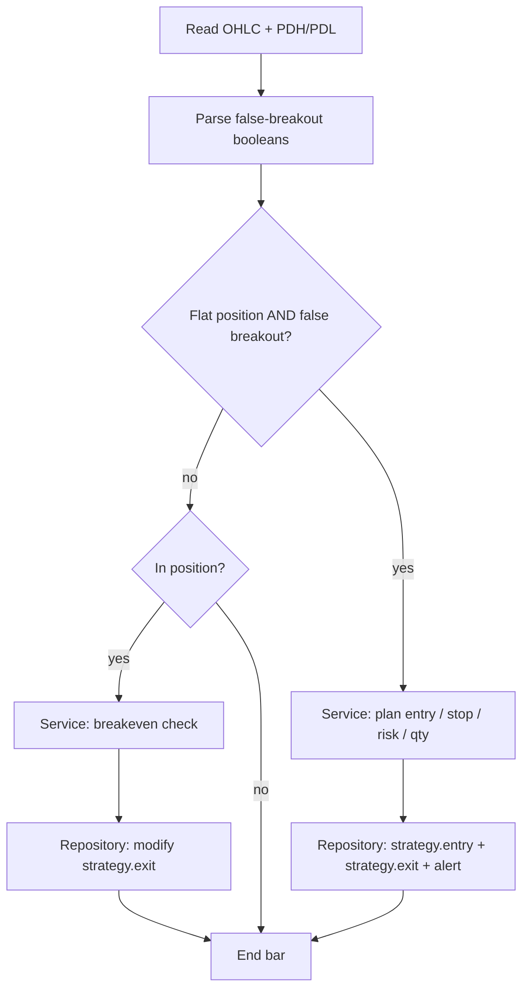

# Design: PDH/PDL Break & Reverse v1

Source brief: `pine-script/docs/strategies/PDH-PDL Break & Reverse/readme.md`
Target file: `pine-script/strategies/PDH-PDL Break & Reverse/pdh-pdl-break-reverse-v1.pine`

> The brief is truncated after the `PDH` definition. Sections 1–2 of the brief
> fully specify the **entry idea**; risk management (stop, target, sizing) is
> unspecified, so this design fills those gaps with the house conventions used
> by `dragon-reversal-v1` and records each assumption in §5.

---

## 1. Business purpose

Trade false breakouts of the **previous day's range** on XAUUSD 15m.
A push beyond a prior-day extreme that fails to hold by the candle close is
read as a liquidity grab, and the strategy fades it back into the range.

**Market / timeframe**: XAUUSD, 15m (works on any intraday timeframe).

**Inputs**
- OHLC stream of the trading symbol/timeframe.
- Previous day high (`PDH`) and low (`PDL`) from the daily timeframe.
- Risk parameters: risk %, stop offset ticks, breakeven offset ticks, R-targets.

**Outputs**
- Strategy entries (long / short) sized at a fixed **% equity risk** per stop.
- Staged exits: 50 % at `+tp1R`, remainder at `+tp2R`, with a dynamic stop.
- Breakeven push when floating profit ≥ 1 R.
- Webhook `alert()` payload (shared format with `dragon-reversal-v1`).

---

## 2. Use case

> On a confirmed 15m candle, if price made a false breakout of the previous
> day's high or low, open a single reversal position against the breakout.

**Signal candle rules (V1 — the signal candle only, no confirmation candle):**
- **False upside breakout → SHORT**: `high > PDH` AND `close < PDH`.
- **False downside breakout → LONG**: `low < PDL` AND `close > PDL`.

---

## 3. Input / output model

**Input model** — derived per bar from the Reader:
- `pdh`, `pdl` — previous completed daily high / low (non-repainting).
- `tickOff`, `breakOff` — mintick-scaled offsets.

**Output model** — per-trade plan tuple `(entry, stop, risk, qty)`:
- `entry = close` of the signal candle.
- Short `stop = high + tickOff`; Long `stop = low - tickOff` (signal-candle extreme).
- `risk = |entry - stop|`; `qty = (equity × riskPct%) / risk`.

---

## 4. Data flow

```
Reader → Parser → Validator → Service → Repository
```

- **Reader** — read OHLC; pull `pdh`/`pdl` via `request.security` on `"D"`;
  compute mintick offsets.
- **Parser** — fold raw price geometry into two booleans: `falseBreakUp`,
  `falseBreakDown`.
- **Validator** — combine with the flat-position gate ⇒ `longTrig` / `shortTrig`.
  Each sub-condition is exposed as a Data-Window debug plot.
- **Service** — pure planners `planLong()` / `planShort()` and the `beStop()`
  breakeven helper; one-position state machine via `var`s.
- **Repository** — `strategy.entry`, `strategy.exit`, `strategy.close`, `alert()`.

No layer reaches across: the service never plots, the repository never decides.

### Mermaid



---

## 5. Domain rules & assumptions

| Rule | Source |
| --- | --- |
| `PDH`/`PDL` = high/low of the **previous completed** daily candle | brief §2 |
| Short on false upside breakout; long on false downside breakout | brief §1 |
| V1 acts on the signal candle only — no confirmation candle | brief §1 |
| **[assumed]** Stop sits just beyond the signal candle's extreme | house style |
| **[assumed]** Risk sized to a fixed % of equity per stop | house style |
| **[assumed]** Staged R-multiple exits (50 % @ tp1R, rest @ tp2R) + breakeven | house style |
| **[assumed]** One position at a time; no pyramiding / reversing | house style |
| **[assumed]** Act only on confirmed (closed) bars | non-repaint safety |

`PDH`/`PDL` use `lookahead_on` with a `[1]` index — the standard
non-repainting idiom for reading a higher-timeframe *previous, completed* value.

---

## 6. Architecture boundary

| Layer | Members | Reason to change |
| --- | --- | --- |
| Reader | `pdh, pdl, tickOff, breakOff` | data source changes |
| Parser | `falseBreakUp, falseBreakDown` | signal definition changes |
| Validator | `longTrig, shortTrig` | trigger gating changes |
| Service | `planLong, planShort, beStop`, state `var`s | risk model / lifecycle changes |
| Repository | `payload`, `strategy.*`, `alert` | execution / bridge protocol changes |

Function-length budget: each function ≤ 30 lines; file total ≤ 300 lines.

---

## 7. Edge cases

| Case | Handling |
| --- | --- |
| Warm-up: `na` PDH/PDL | `na`-guarded compares → no trigger |
| Both long & short trigger same bar | impossible (a candle can't close both sides); long checked first regardless |
| `risk ≤ 0` (degenerate candle) | `planX` returns `qty = 0`, entry skipped |
| Equity = 0 at backtest start | `qty = 0`, entry skipped |
| Repeat trigger while in position | entry gate `gDir == 0 ∧ position_size == 0` blocks it |
| Stop/TP fill leaves ghost state | reset block clears all `var`s once flat |
| Intrabar repaint | entries gated on `barstate.isconfirmed` |

---

## 8. Test strategy

Pine has no unit harness; validation is visual + backtest:
- **Parser** — toggle debug markers; confirm `falseBreakUp/Down` fire only on
  candles that pierced and closed back inside the prior-day range.
- **Validator** — Data-Window plots show each gate so a missed setup is traceable.
- **Service** — inspect `qty`/`risk` in the Data Window; verify 1 %-equity sizing.
- **Repository** — Strategy Tester order list confirms staged exits & breakeven.

---

## 9. Risks & trade-offs

- V1 has no confirmation candle, so it will take some genuine breakouts that
  only briefly closed back inside — accepted per brief (a later vN can add a
  confirmation filter).
- A fixed R-target ignores where `PDH`/`PDL` sit relative to entry; a future
  version could target the opposite prior-day level instead of a flat R-multiple.
- `lookahead_on` is safe **only** because the requested expression is already
  shifted by `[1]`; never request a same-day value this way.
